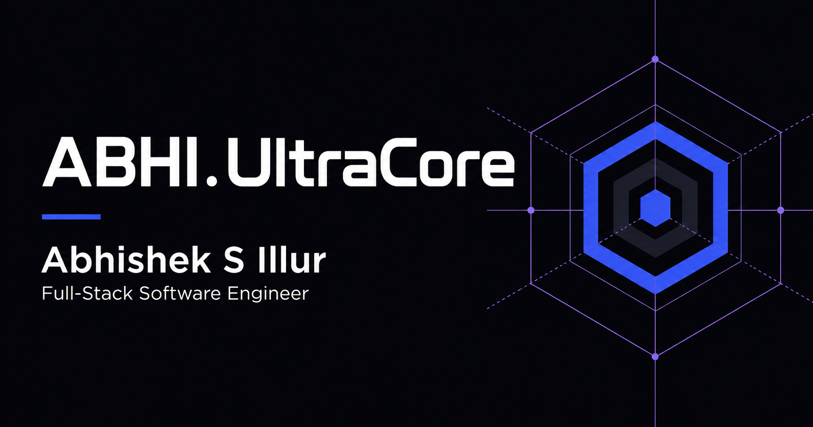

# ABHI.UltraCore

An interactive portfolio for **Abhishek S Illur**, a full-stack software engineer focused on scalable SaaS products, modern web applications, AI integrations, and workflow automation.



## Live site

[Open ABHI.UltraCore](https://abhi-ultracore.nagashree143.chatgpt.site/)

## Highlights

- Interactive 3D hero scene with pointer-responsive depth
- Expandable service overview covering frontend, backend, SaaS, AI, and automation
- Detailed product case studies with interactive interface previews
- Professional experience and verified LinkedIn profile
- Continuously moving skills showcase
- Individual certificate previews and PDF documents
- Downloadable résumé with availability checks and a helpful fallback
- Responsive layouts for desktop, tablet, and mobile
- Dark and light themes with saved user preference
- Keyboard navigation, visible focus states, reduced-motion support, and semantic landmarks
- Search, social-sharing, sitemap, robots, favicon, and Open Graph metadata

## Technology

- [Next.js 16](https://nextjs.org/) with the App Router
- [React 19](https://react.dev/)
- [TypeScript](https://www.typescriptlang.org/)
- [Tailwind CSS 4](https://tailwindcss.com/)
- [Framer Motion](https://motion.dev/)
- [Lucide React](https://lucide.dev/)
- Static export for portable hosting

## Getting started

Node.js **22.13 or newer** is required.

```bash
git clone https://github.com/abhisheksillur2003/Abhi.UltraCore.git
cd Abhi.UltraCore
npm ci
npm run dev
```

Open [http://localhost:3000](http://localhost:3000) in your browser.

## Available commands

```bash
npm run dev      # Start the development server
npm run build    # Create the production static export in out/
npm run lint     # Run the project linter
npm run format   # Format the codebase
```

## Project structure

```text
app/
  layout.tsx       Metadata, fonts, theme bootstrap, and page shell
  page.tsx         Main portfolio sections and content composition
  globals.css      Visual system, animation, and responsive styling
components/
  brand-mark.tsx   ABHI.UltraCore identity mark
  experience.tsx   Navigation, theme, reveal, cursor, and UI utilities
  hero.tsx         Interactive hero presentation
  projects.tsx     Project case studies and interface previews
  services.tsx     Expandable services section
data/
  content.ts       Services, skills, certificates, and contact details
public/
  certificates/    Certificate previews and individual PDFs
  og.png           Social sharing image
  Abhishek_Software_Engineer.pdf
```

## Content updates

Most reusable portfolio content lives in [`data/content.ts`](data/content.ts). Project narratives are in [`components/projects.tsx`](components/projects.tsx), while the experience and contact presentation is composed in [`app/page.tsx`](app/page.tsx).

When changing the hosted domain, update the origin in:

- `app/layout.tsx`
- `app/robots.ts`
- `app/sitemap.ts`

## Production build

```bash
npm run build
```

The site uses Next.js static export and writes the deployable output to `out/`. Configure the host to serve `404.html` for unknown routes with an HTTP 404 status.

## License

This repository contains the personal portfolio, résumé, certificates, and original work of Abhishek S Illur. Please do not reuse personal content or branding without permission.
